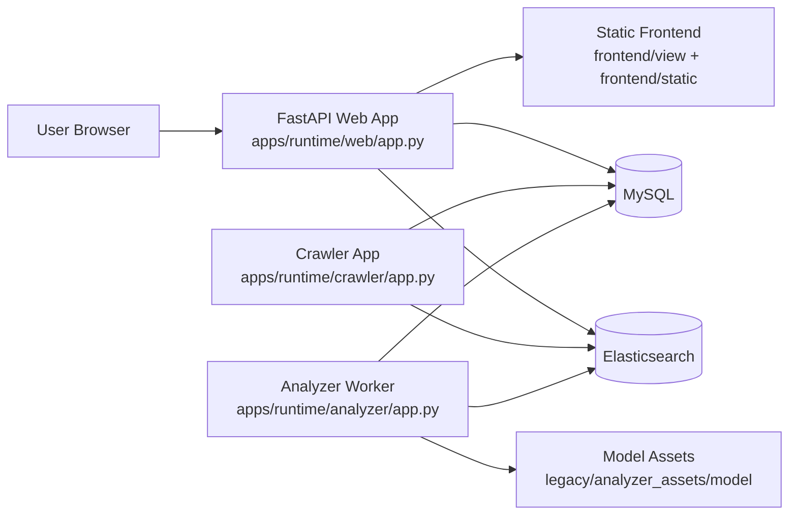
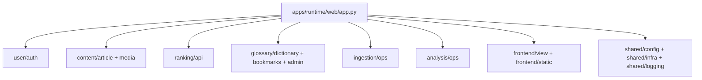
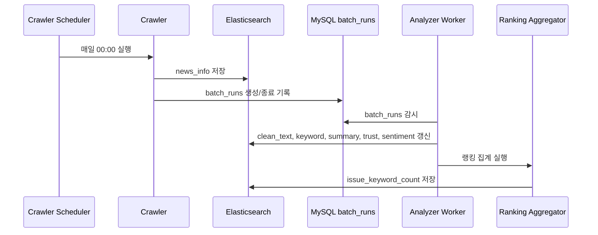

# 프로젝트 아키텍처

## 1. 개요

이 프로젝트는 경제 뉴스 수집, 분석, 랭킹 집계, 사용자 기능, 경제 용어 서비스를 하나의 저장소에서 운영하는 구조입니다.

핵심 흐름은 아래와 같습니다.

1. 크롤러가 네이버 뉴스 기사를 수집해 Elasticsearch `news_info` 인덱스에 적재합니다.
2. 분석 파이프라인이 수집 배치를 감지해 기사 본문 정제, 키워드 분류, 요약, 신뢰도, 감성 분석을 수행합니다.
3. 분석 결과를 바탕으로 이슈 키워드 랭킹과 연관 키워드를 Elasticsearch `issue_keyword_count` 인덱스에 집계합니다.
4. 웹 애플리케이션은 FastAPI를 통해 랭킹, 기사, 사용자, 용어 사전, 관리자 기능을 제공합니다.
5. 화면은 `frontend/view`, `frontend/static`에 있는 정적 HTML/CSS/JS를 FastAPI가 서빙합니다.

## 2. 상위 구조

```text
mbc_2team-main/
|- apps/
|  |- core/        # 도메인별 비즈니스 로직
|  |- runtime/     # 실행 엔트리포인트
|  |- shared/      # 공통 설정, DB/ES 연결, 로깅
|  |- service/     # 일부 보류/레거시 성격 모듈
|  |- analyzer/    # 일부 보류/레거시 성격 모듈
|  `- common/      # 일부 보류/레거시 성격 모듈
|- frontend/
|  |- view/        # 정적 HTML
|  `- static/      # JS, JSON, 기타 프론트 자산
|- legacy/
|  `- analyzer_assets/
|     |- model/    # 학습/추론 모델 자산
|     |- data/     # 분석용 데이터
|     `- old_version/
|- docs/
|- scripts/
`- tests/
```

## 3. 런타임 구성

현재 실제 실행 진입점은 `apps/runtime` 아래에 분리되어 있습니다.

- `apps/runtime/web/app.py`
  FastAPI 기반 웹 애플리케이션
- `apps/runtime/crawler/app.py`
  뉴스 수집 서비스 엔트리
- `apps/runtime/analyzer/app.py`
  분석 워커 엔트리



## 4. 웹 애플리케이션 구조

`apps/runtime/web/app.py`는 FastAPI 앱을 생성하고 아래 라우터를 조합합니다.

- 사용자: `apps/core/user/auth`
- 기사/콘텐츠: `apps/core/content`
- 랭킹 API: `apps/core/ranking/api`
- 경제 용어/북마크: `apps/core/glossary`
- 수집 관리자: `apps/core/ingestion/ops`
- 재분석 관리자: `apps/core/analysis/ops`

또한 아래 역할을 함께 수행합니다.

- 시작 시 MySQL, Elasticsearch 연결 검증
- 세션 미들웨어 등록
- `/static`, `/view` 정적 파일 마운트
- `/`, `/main`, `/login` 같은 페이지 경로를 정적 HTML로 리다이렉트



## 5. 배치 파이프라인

### 5.1 수집 단계

크롤러는 APScheduler로 매일 00:00(KST)에 실행되며, 전일 날짜 기준으로 네이버 뉴스 목록을 순회합니다.

수집 단계의 주요 처리:

1. 기사 목록 URL 생성
2. Selenium + ChromeDriver로 기사 링크 수집
3. 기사 본문, 제목, 기자명, 언론사, 발행시각 파싱
4. `news_info` 인덱스에 bulk 저장
5. MySQL `batch_runs` 테이블에 실행 이력 기록

관련 위치:

- `apps/core/ingestion/crawler/main.py`
- `apps/core/ingestion/crawler/db.py`
- `apps/core/ingestion/batch_runs/batch_runs_repo.py`

### 5.2 분석 단계

분석 워커는 `batch_runs`를 감시하다가 메시지가 채워진 배치를 감지하면 분석을 수행합니다.

분석 순서:

1. `clean_text` 생성
2. 이슈 키워드 예측
3. 기사 요약 생성
4. 신뢰도 분석
5. 감성 분석
6. 날짜별 이슈 키워드 카운트 집계
7. 연관 키워드 집계
8. 누락 키워드 백필

관련 위치:

- `apps/core/analysis/pipeline/main.py`
- `apps/core/analysis/enrichment/*`
- `apps/core/ranking/aggregation/*`



## 6. 저장소 역할

### MySQL

정형 데이터와 운영성 메타데이터를 저장합니다.

대표 테이블:

- `users`
- `roles`
- `user_roles`
- `login_log`
- `economic_terms`
- `user_term_bookmarks`
- `batch_runs`
- `analysis_task`

초기 스키마는 `docs/schema_init.sql`에 정의되어 있습니다.

### Elasticsearch

검색/집계 중심 데이터 저장소입니다.

대표 인덱스:

- `news_info`
  수집 기사 원문, 메타데이터, 분석 결과 저장
- `issue_keyword_count`
  날짜별 이슈 키워드 카운트, 서브키워드, 요약 저장
- `clean_text`
  분석 중간 산출물 저장

## 7. 도메인별 책임

### `apps/core/ingestion`

- 뉴스 수집
- 수집 배치 실행 이력 관리
- 관리자 수동 수집 기능

### `apps/core/analysis`

- 본문 정제
- 키워드 분류
- 기사 요약
- 신뢰도/감성 분석
- 관리자 재분석 기능

### `apps/core/ranking`

- 키워드 랭킹 집계
- 대시보드 API
- 키워드 트렌드/워드클라우드 API

### `apps/core/content`

- 기사 목록/상세 조회
- 요약 조회
- 언론사 로고, 기사 이미지 보강

### `apps/core/user`

- 회원가입/로그인/로그아웃
- 아이디 찾기/비밀번호 변경
- 마이페이지 세션 기반 인증

### `apps/core/glossary`

- 경제 용어 목록/상세
- 즐겨찾기
- 관리자 용어 관리

## 8. 프론트엔드 구성

프론트엔드는 별도 SPA 빌드 시스템 없이 정적 파일 기반으로 구성되어 있습니다.

- HTML: `frontend/view/*.html`
- JS: `frontend/static/*.js`
- CSS: `frontend/view/css/*.css`
- 이미지/로고: `frontend/view/img/*`

FastAPI가 `/view`, `/static` 경로로 직접 서빙합니다.

## 9. 환경 설정

공통 환경 변수는 `apps/shared/config/env.py`에서 관리합니다.

주요 설정:

- MySQL 연결 정보
- Elasticsearch URL
- 세션 시크릿 키
- Gemini API Key
- 감성/신뢰도/이슈 분류 모델 경로
- 경제 용어 CSV 경로

## 10. GitHub 업로드 시 함께 설명하면 좋은 포인트

README 또는 저장소 소개에 아래 한 줄 요약을 넣기 좋습니다.

> FastAPI 기반 웹 서비스와 뉴스 수집/분석 배치가 결합된 경제 뉴스 인사이트 플랫폼으로, MySQL은 운영 데이터, Elasticsearch는 기사 검색 및 랭킹 집계를 담당합니다.

추가로 강조하면 좋은 키워드:

- Monorepo
- FastAPI
- Selenium crawler
- Elasticsearch analytics
- Scheduled batch pipeline
- Session-based auth
- Static frontend

